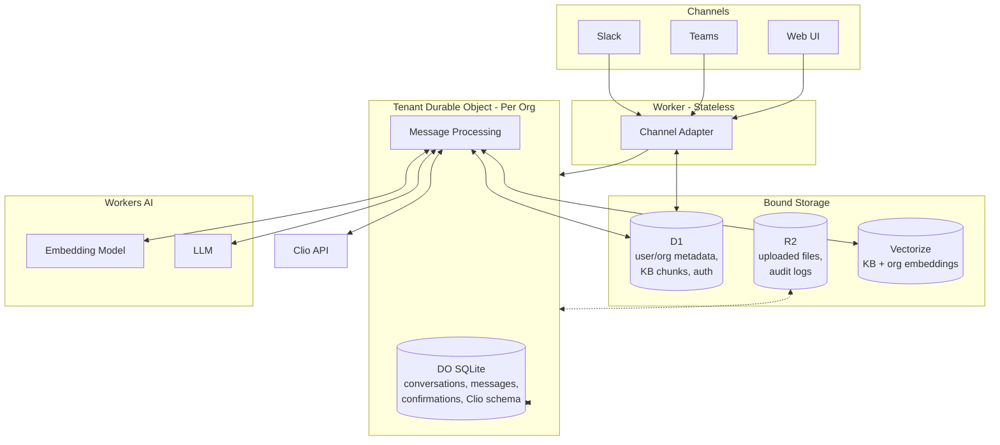

[docketadmin.com](https://docketadmin.com)

I worked on Docket after my friend who runs an agency shared with me an organized knowledge base of his operating procedures. He wanted to build out a service that could pull from his knowledge base, access organizational context his clients would share with him, connect to their CRM, and could work through Slack. He wanted to replace himself within his own business, experiment with creating AI versions of himself to sell to clients.

We both read the book E-Myth Revisited by Michael Gerber about a year earlier, we both had hypotheses on how Gerber's system of documenting yourself could be applied in the AI age - and my friend had an amazing knowledge base to work from.

## Hypothesis

We settled on a hypothesis: (Industry Knowledge Base for focused AI thinking + Company Organizational Context like operating procedures + Tool Calls to a company's CRM for dynamic context) + Chat Interface that lives in a user's Slack channel would provide value for businesses.

First I needed to handle authentication from the CRM to Slack through a server.
Second I had to make sure the Slack messages and conversation history could be read by an LLM.
Third, I needed the LLM to be able to be "trained" on organizational context - documents uploaded to the server directly.

## Cloudflare Workers

I was introduced to the Cloudflare Workers architecture through MCP work which would come in handy later for tool calls, and their "Workers AI" seemed promising. Their revamped "Durable Objects" also proved extremely helpful.

Durable Objects are isolated, single-threaded storage units with their own embedded SQLite. They bind to multiple different databases like SQL, key-value storage, object storage, vector databases, and cron jobs . Durable object automatically coordinate access to all databases and enforce sequential execution.

I designed the Worker to create a Durable Object for each organization. To handle multiple different message types (Slack, Teams, Web UI) I created a channel interface function that receives the messages and normalizes them for the Worker to pass to the Durable Object. Each new interface needed some upfront work to set up the normalizing function, but once the message data was normalized, the Worker infrastructure became interface-agnostic.

{{ mermaid chart showcasing my architecture }}

## Multitenant Architecture

The processing worker received the message from the Channel Interface adapter and sent it to the law organization's own Durable Object. Each law organization had their own isolated Durable Object - these storage objects were physically separate so each organization's data was physically separate from another's.

The Durable Object managed conversations, message history, custom field schemas, audit logs, and confirmation states with its own SQLite storage. Its stateful structure guarantees sequential order of operations which was critical because the LLM would access all bound databases at once.

## Storage Architecture

Workers are stateless servers that are also bound to Durable Objects (stateful data that exists per org) and then attach to external services via bindings:

- D1 (global database stored user and org metadata, chunks of the knowledge base that the LLM would access)
- R2 database which would store objects that wouldn't be accessed often like uploaded files (which are parsed and embedded into D1), audit logs, and archives.
- Vectorize database pre-processed the knowledge base and the organizational embedded data from uploaded docs

Cloudflare also has an insane Workers AI tool that stored the LLM (the prices are unbeatable) and the embedding tool.

D1 handled user and org metadata, auth sessions, KB chunks, invitations, and subscriptions. The Durable Object SQLite held conversations, messages, pending confirmations, and the custom Clio schema caches that each law firm had.

D1 was for cross-tenant global lookups (user and org metadata).

## The Pivot

At this point, my friend wanted to proceed a bit differently and that was fine, I wanted to continue working on the project.

So FIRST VERSION problems we identified from it (Slack fundraising bot): communicating and executing API calls with Slack was possible - the org context uploading was an issue.

How what we learned from an unsuccessful first version would apply to the second: to continue working on the project I needed to find another industry to study.

## Why Lawyers and Initial Talks with Lawyers

I needed to find a Salesforce-like tool that was specific to an industry. I know a lot of lawyers (for better or worse) and knew that Clio was a growing CRM that most users were really happy with. Some administrative assistants honestly live on it. There were administrative assistants and small business owners that utilized it. I also explored what this tool would look like as a learning tool for legal clinics - I made sure to have two separate logins for legal clinics and law firms.

One of the difficulties in some lawyers' actual practices was distinguishing between different jurisdictions. I didn't realize how much different jurisdictions determine how to proceed through cases, the ins and outs of each, why that can create issues for lawyers. There had to be separate knowledge bases for different jurisdictions and different industries. What was not important was making sure the knowledge base was precise - that duty would have to be for a legaltech cofounder - what could be solved for is seeing if the LLM could distinguish between the two.

## Auth Architecture

For Docket accounts, I chose Better Auth because it's free and has native Cloudflare Workers + D1 support. Better Auth stores user accounts, passwords, and sessions in D1. I liked the idea of owning the data rather than an external service. For Web, Better Auth could handle session cookies. I knew linking Slack and Teams wouldn't be as simple - so being able to hold all the data seemed simpler and we could focus on linking up Teams and Slack.

To set up the link with Teams, I used Microsoft's pre-built bot framework's `OAuthCard` component. This generated an access token and the user profile (including their Microsoft email). The worker would receive this from the Bot Framework and added the user email to D1 records for uninterrupted conversations moving forward.

Slack didn't have a built-in SSO helper like Teams did, so I had the Slack bot use a Better Auth magic link - the Slack Bot would send back a URL if they didn't recognize the user, the magic link provided by Better Auth would send the user's Slack ID to the worker where it was stored similarly to the Teams email.

Adding a new channel required some initial setup, but after the auth was created, the messages were normalized by the Channel Interface Adapter before going to the Worker, keeping the worker functions interface-agnostic.

## On Interfaces

The first version of this project was done exclusively for Slack. It validated that the Slack channel could be used, and that API calls could be executed with Slack Bots. From talking to lawyers, I knew that Microsoft Teams was their most popular "chat system for work". For Docket to work, I thought we should focus on Teams. I quickly spun up a similar proof of concept, creating a Teams app, permissions granted, having Slack accept OAuth from Clio, and the same process with Slack was validated.

During development, I pivoted to focusing on the web app. I had to create a website anyway for users to create accounts, add and remove members from their organization, upload organizational context, and manage their payment plans in the future. The framework of the site was built, Teams had a high onboarding friction for getting users to test it, and Teams felt like a black box.

It was easier to make the web chat observable, for myself on the backend, and for users. I built a web UI with conversation history, the chat messages, and a process log showing sources that the LLM reads from in the Knowledge Base and org context in real time. The process log was the fun part.

{{ include photos of process log }}

Web UI could run on Server-Sent Events (SSE). Message goes in, events stream back - content tokens as the LLM generates them, process updates for the sidebar, confirmation requests when the bot wants to write to Clio.

{{ confirmation messages }}

This was also much less onboarding friction for users to come in and test the bot. I didn't envision the Web App to be the main interface moving forward, but a great first step for the proof of concept and testing. It went from "Link up your Teams account, do the authentication, and tell me what it says back" to "Go to docketadmin.com and upload some org documents, let me know if the chatbot read them properly, let me know what you thought about what it said back."

## The Knowledge Base

Two sources feed RAG: the shared Knowledge Base (jurisdiction and practice content I upload) and org-specific context (documents each firm uploads).

The knowledge base divided by jurisdiction and practice type would be manually uploaded by me through a tool I built, reading from markdown files organized so the folder path determined the metadata - files in `/kb/jurisdictions/CA/` got tagged with `jurisdiction: "CA"`, files in `/kb/practice-types/family-law/` got `practice_type: "family-law"`. General content and federal jurisdiction always get included for every org. When a California family law firm asks a question, Vectorize returns chunks from general, federal, California, and family law folders.

The tricky part I discovered was Vectorize doesn't support `OR` filters. If I want general `OR` federal `OR` California content, I can't write that as one query. So I run parallel Vectorize queries - one for each filter - then merge results by score and dedupe. An org with multiple jurisdictions and practice types might trigger 10+ parallel queries, but they're fast and the deduping handles overlap.

The data was added to Vectorize for semantic search, then chunked at ~500 characters and stored in D1. RAG locates relevant chunks through vector similarity, fetches the full text from D1, and injects it into the system prompt. Token budget caps it at ~3,000 tokens for RAG context - if there's too much relevant content, lower-scored chunks get dropped.

My friend's documentation was organized and worked really well with Retrieval Augmented Generation (RAG). The knowledge base was processed into Cloudflare's Vector Storage, essentially "training" the data as AI could preprocess the data while warming up. For lawyers, I was nervous to commit to building a knowledge base myself as I am not a lawyer and Docket was not to replace one, just their administrative assistance. I used sample textbooks I could find online and could recognize when content came from there. Didn't work as well, but good enough for trial.

## Org Context Uploads

For org context uploads, I built the full pipeline: admin uploads a file through the web interface, server validates it (MIME type, magic bytes, 25MB limit), stores the raw file in R2 at `/orgs/{org_id}/docs/{file_id}`. Then Workers AI's `toMarkdown()` parses PDFs, DOCX, XLSX, and other formats into text. The text gets chunked, stored in D1's `org_context_chunks` table, embedded, and upserted to Vectorize with metadata `{ type: "org", org_id, source }`. The `type: "org"` filter keeps org context completely separate from the shared knowledge base in queries. Deletes work by removing all chunks with matching IDs from both D1 and Vectorize, then deleting the raw file from R2. Updates are just delete-then-reupload.

The semantic vectorize database search and chunk retrieval from D1 works the same way for org context liek it does in the knowledge base: Worker receives user message → search Vectorize → get IDs → fetch full chunks from D1 → inject into prompt.

## On the Tool Calls

Tools are super important for MCPs and I wanted to keep that avenue open. Beyond MCP, tools also served a practical way for AI to interact with the database. Imagine a tool as a super strict command that the AI can toss parameters into.

In the first version, I had the idea of creating 4 tools that could execute specific commands. There was a lot of friction for developing each tool call, and I was underwhelmed with the work to create one and the individual impact of each tool. In the first version the tools were executed, the scope was small, but best of all the AI tool struggled with deciding what tool to use.

For Docket, I tried to attack it differently. I wanted to experiment with the idea of an "API call knowledge base" that the tool call would use to create a perfect API call parameter. This was a failure. The LLM could not reliably build out a proper tool call on the fly - with all the context floating around in conversations and exact instructions - it proved too much for an LLM in a single call to define what they need, read the instructions, and follow them reliably.

Setting up multiple tool calls is the right way to go about this - but there is a huge overhead if they ever change which needs to be accounted for (maybe polling for the API docs to make sure they are the same, if not, auto shutdown, then developer needs to manually scramble to turn back on all the tools. This is something someone needed to be available for.)

It would have been easier to create a directory on what tool to call and why rather than parameter building instructions. Make the orchestration of what tool to call non-deterministic, and then the actual tool call would be purely deterministic. Trying to consolidate all the tools cleverly backfired.

## On Commanding Clio

_side note this is a really good example of end to end thinking, take care with this_

_this parses through pricing strategy/business needs - to the user experience with accepting commands like Claude - to the technical execution_

As something to potentially price out later (plan was everyone in org would have access to knowledge base and org context, as well as run "read" operations with Clio - "what are upcoming cases on the calendar") only admins should be able to run commands with Clio - like "add a date to my calendar".

I had to set up safeguards for Docket to use Clio data.

I had to make sure the user consented to Create/Read/Delete functions. They had to be actually being executed and present it to them in a way they understand. The Docket bot had to communicate back to the user before doing an edit, similar to how Claude Code asks before editing code. I tried to emulate that, the pending confirmations were held in Durable Object state with message, the channel adapter had to be modified to work two ways and work quickly, an ez-pass lane had to be set up for this to run fast.

## Agentic Developing

Most of this was developed with Claude following spec-driven development. It was an introduction to learn more about testing for me as test-driven development has been a huge help.

How I used spec-driven development to explore what could be done - reflection how a lot of this was done through spec-driven development. This is an unfamiliar technology and idea. Writing specs helped me understand the high-level architecture, being able to recognize problems I would need to solve in the future earlier in the process. I ran a test suite as well, focused more on developing the tests and making sure I understood what they needed to be before proceeding with them. Development moved faster because of it. It's a tool to use, but taking the time to understand when something goes wrong is important.

## Technical Flow

## Example Flow

A user messages "What cases do I have next week" in a channel such as Microsoft Teams, Slack, or the Web App. That message hits the Slack channel adapter in JSON format including the channel ID (Slack), the user metadata, and timestamps. The message is transformed into a normalized format by the Channel Adapter which queries the D1 database for the user record, the user's organization metadata (industry, jurisdiction, ID), and user's role (admin or member). The adapter sends a clean, normalized message with user and org context to the Worker.

The worker routes this message directly to the correct Durable Object. The Durable Object wakes up from hibernation and immediately stores the message in its SQLite - this becomes the conversation history that the LLM can access. The Durable Object then generates an embedding of the message using Workers AI, a vector representation of what the user asked for RAG.

That embedding is sent to the bound Vectorize database twice in parallel - once to search the shared Knowledge Base, the other embedding to search through the org's uploaded context documents. Vectorize returns chunk IDs of the semantically similar context from the huge knowledge base and org documents libraries. The chunks themselves live in D1, where the full text is retrieved from.

The D1 chunks, the user's message, and the conversation history are queried as parameters for the system prompt that gives the LLM guardrails and instructions. The Clio schema from the memory cache is attached to the prompt so the LLM knows what objects exist in each organization's Clio. All of this is packed into one context window - a conversation on the web UI or a Slack or Teams thread.

Cloudflare's Workers AI runs the LLM. If the LLM decides to call the Clio API, we validate user permissions. Read operations execute immediately; write operations require confirmation first.

The response from the LLM flows back through the worker to the Channel Adapter again, which reformats the message for the respective Channel and sends it back to the user.

Durable Objects allow the whole thing to happen in sequence, no race conditions. The Durable Object processes one message completely before touching the next one, every operation is logged.

## On Retrospective

Our winning structure never really played out. I'm continuing to work on Docket in active development because I believe in the infrastructure and the goal to combine org context, knowledge base, and API calls. I think the scope needs to be majorly reduced.

Giving an LLM model unconstrained access to an API not controlled by you is a recipe for disaster. Patterns emerged while talking to it felt like relearning how to execute the Clio commands.

Reflection: note how I'm starting to realize the problems of shoehorning this technology, reflection on better applications for it (personal API that you control, big danger letting the robot run wild, even with querying parameters, it's really unchecked and creating those guardrails wasn't something I really cared to explore) - RAG was a huge success, Cloudflare parsing files and doing it was also a huge success.

This tool felt needless. You had to get used to describing things in a specific way to get what you want, might as well learn how to operate Clio - it was producing poor results and there would be nobody to blame.
